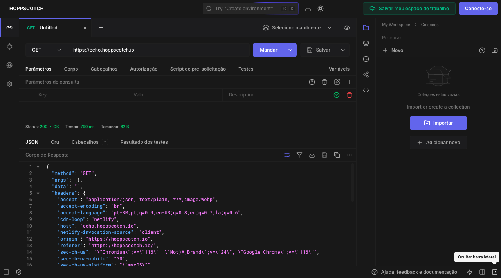

---
<h1 align="center">📤  Devstage Api</h1>



<p align="center">
<b>Um sistema de indicações que conecta desenvolvedores a comunidades e oportunidades em tecnologia. 🚀</b>
</p>

## Requisitos

- Node.js;
- TypeScript;
- Tsup;
- Fastify;
- Fastify Cors;
- Fastify Swagger;
- Fastify Swagger UI;
- Fastify Type Provider Zod;
- Zod;
- Drizzle;
- Drizzle Kit;
- Postgres;
- Ioredis;
- Docker;
- Biome;

## Configuração

- Clonar o repositório;
- Instalar dependências (`npm install`);
- Configurar PostgreSQL e Redis (`docker compose up -d`);
- Copiar `.env.example` arquivo (`cp .env.example .env`);
- Rodar aplicação (`npm run dev`);
- Teste! (Eu pessoalmente recomendo testar com [Hoppscotch](https://hoppscotch.io/)).

## HTTP

### POST `/subscriptions`

Cria uma nova inscrição.

#### Request body

```json
{
  "name": "string",
  "email": "user@example.com",
  "referrer": "string | null"
}
```

#### Response body

```json
{
  "subscriberId": "string"
}
```

---

### GET `/invites/{subscriberId}`

Acessa o link de convite de um inscrito.

#### Path parameters

- `subscriberId` (string, obrigatório): O identificador do inscrito.

#### Response

- **302 Found** - Redirecionamento para o link de convite.

---

### GET `/subscribers/{subscriberId}/ranking/clicks`

Obtém a contagem de cliques nos convites do inscrito.

#### Path parameters

- `subscriberId` (string, obrigatório): O identificador do inscrito.

#### Response body

```json
{
  "count": 0
}
```

---

### GET `/subscribers/{subscriberId}/ranking/count`

Obtém a quantidade total de convites do inscrito.

#### Path parameters

- `subscriberId` (string, obrigatório): O identificador do inscrito.

#### Response body

```json
{
  "count": 0
}
```

---

### GET `/subscribers/{subscriberId}/ranking/position`

Obtém a posição do inscrito no ranking.

#### Path parameters

- `subscriberId` (string, obrigatório): O identificador do inscrito.

#### Response body

```json
{
  "position": 1
}
```

---

### GET `/ranking`

Obtém o ranking geral dos inscritos.

#### Response body

```json
{
  "ranking": [
    {
      "id": "string",
      "name": "string",
      "score": 0
    }
  ]
}
```

---

## 👩‍💻 Desenvolvedora

Feito com 💜 por **[Vanessa Brazuna](https://github.com/vanessabrazuna)**

Conecte-se comigo no [LinkedIn](https://www.linkedin.com/in/vanessabrazuna) para acompanhar mais projetos incríveis! 🚀

---

